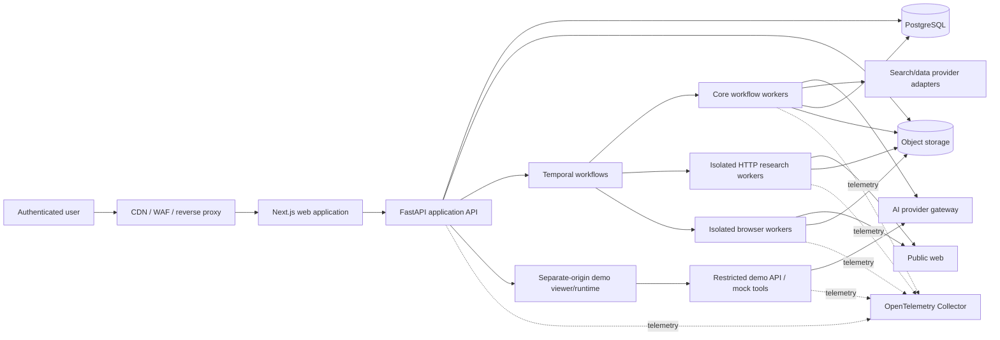
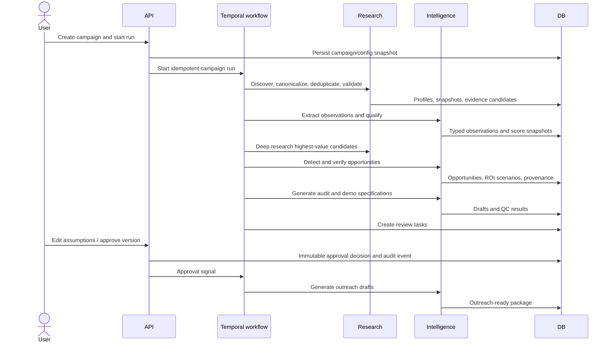
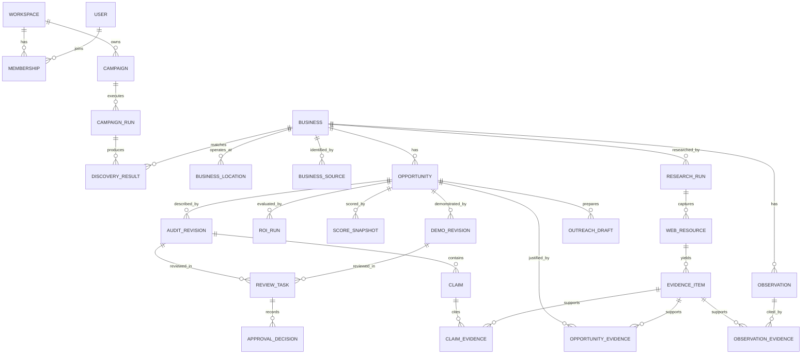
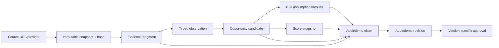
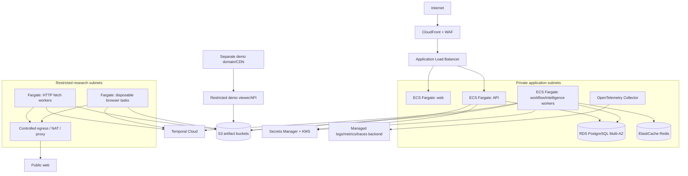

# Autonomous Business Opportunity Detection & Demo Generation System

## Greenfield Architecture and Implementation Plan

**Status:** Architecture only; no application implementation exists or is implied by this document.
**Source of truth:** `C:\Users\eugen\Downloads\chatgpt_conversation.md`, extracted 2026-08-14.
**Document date:** 2026-08-14.
**Intended audience:** Product owner, engineering lead, application engineers, data/AI engineers, security reviewers, and operations engineers.

---

## 1. Purpose, boundaries, and notation

The product is an intelligence engine that discovers businesses, collects public evidence, identifies expensive and feasible automation opportunities, produces evidence-linked audits and realistic simulations, and prepares outreach for human approval. Its primary value is the end-to-end `business -> research -> opportunity -> audit -> demo` loop.

This document deliberately does not design or authorize autonomous outreach, authenticated scraping, CAPTCHA bypass, identity impersonation, arbitrary generated-code execution, or any other behavior prohibited by the source specification.

Decision labels used throughout:

- **[SPEC]** — directly required or strongly implied by the source specification.
- **[RECOMMENDATION]** — architectural judgment proposed here, not a product requirement from the source.
- **[APPROVAL]** — a consequential choice that the product owner or accountable technical/security owner must approve before implementation.
- **[POST-MVP]** — intentionally excluded from the first release.

When an implementation detail is unspecified, this architecture favors the smallest reversible choice that preserves evidence integrity, security boundaries, and future extensibility.

---

## 2. Requirements distilled from the source

### 2.1 Required product outcomes

For each discovered business, the system must be capable of producing:

1. A structured business profile.
2. Qualification and opportunity scores.
3. Public-source evidence with source URLs and capture times.
4. Explicitly classified observations and detected problems.
5. Explainable, assumption-driven value ranges.
6. A recommended AI-enabled workflow.
7. A personalized, evidence-linked audit.
8. A personalized demo specification and selected demo assets/modes.
9. Quality-control results.
10. Human-review state.
11. An outreach package only after approval.

### 2.2 Non-negotiable behavioral constraints

- Optimize for high-value, high-confidence opportunities, not maximum prospect volume.
- Separate observed facts from inference, estimate, and recommendation.
- Do not fabricate revenue, headcount, leads, response times, technology, complaints, or internal processes.
- Treat unknown data as unknown and display “Not publicly observable” where appropriate.
- Preserve evidence links and timestamps for significant claims.
- Treat web content as untrusted and prevent it from controlling models or tools.
- Respect applicable privacy, anti-spam, platform, API, website, robots, and rate-limit rules.
- Require human approval before outreach; autonomous outreach remains off by default.
- Build the first release around the complete discovery-to-demo vertical slice.
- Keep industries, opportunity types, model providers, search providers, scoring, and ROI assumptions configurable.

### 2.3 Explicitly out of MVP

- Autonomous calling or purchasing.
- Autonomous outreach or spam-scale sending.
- Complex CRM integrations.
- Massive-scale crawling.
- Complicated multi-agent orchestration.
- Scraping behind authentication or bypassing access controls.

---

## 3. Architectural principles

1. **Evidence before narrative.** Models may interpret normalized evidence; they may not establish facts merely by stating them.
2. **Deterministic math, probabilistic language.** ROI and scoring calculations are implemented as versioned deterministic functions. Models can explain results but cannot perform authoritative calculations.
3. **Untrusted content cannot act.** Components that read the public web have no business-system tools, user secrets, or outbound-contact permissions.
4. **Human approval is a state transition.** Approval is persisted, attributed, version-specific, and auditable—not a front-end convention.
5. **Durable workflows, idempotent activities.** Research and generation jobs must resume after failure without duplicate side effects.
6. **Immutable inputs to approved outputs.** Approved audits, demos, scoring snapshots, and outreach drafts refer to exact evidence/config/model/prompt versions.
7. **Modular monolith before microservices.** Domain boundaries are explicit in code and data, but operational decomposition occurs only where workload or security demands it.
8. **Configuration is versioned data.** Industry rules, opportunity definitions, score weights, ROI models, prompts, and routing policies are versioned and reproducible.
9. **No arbitrary AI-generated production code.** Interactive demos use vetted components and constrained configuration in MVP.
10. **Cost is a first-class signal.** Every search, fetch, browser session, and model invocation is attributable to a campaign, business, and workflow run.

---

## 4. Recommended technology stack

The table distinguishes foundational choices from replaceable adapters. Exact patch versions should be pinned during repository bootstrap and upgraded through tested dependency updates; model names must not be embedded in business logic.

| Layer | Recommendation | Why | Tradeoffs / alternatives |
|---|---|---|---|
| Repository | **[RECOMMENDATION]** One monorepo; Python and TypeScript workspaces; architecture decision records (ADRs) | Atomic schema/API changes, shared contracts, simpler early CI | Polyglot tooling is slightly more complex than a single language |
| Web application | **[RECOMMENDATION]** Next.js App Router + React + TypeScript | Strong fit for a dense authenticated dashboard, server rendering, streaming UI, and a separate demo viewer | A Vite SPA is simpler, but would need more bespoke routing/server integration; Next.js caching behavior must be controlled carefully in authenticated views |
| UI system | **[RECOMMENDATION]** Accessible headless primitives, CSS variables/design tokens, a restrained component library, TanStack Table for dense grids | Supports the specification’s professional, information-dense interface without binding product logic to a visual framework | Component libraries accelerate delivery but require accessibility and bundle-size review |
| API/backend | **[RECOMMENDATION]** Python 3, FastAPI, Pydantic | Python has the strongest web extraction/AI ecosystem; FastAPI provides typed validation, async I/O, dependency injection, and OpenAPI | A TypeScript backend would reduce languages, but Python worker integrations would still likely be needed |
| Persistence | **[RECOMMENDATION]** PostgreSQL; SQLAlchemy 2.x; Alembic migrations | Relational integrity is central to evidence, versions, approvals, and many-to-many provenance; JSONB supports provider payloads without replacing normalized domain tables | Document databases ease schema drift but make joins, constraints, and approval/evidence integrity harder |
| Durable orchestration | **[RECOMMENDATION] [APPROVAL]** Temporal with Python SDK | Campaigns are long-running, retry-heavy, scheduled, and pause for human review. Durable execution avoids building a fragile job-state machine and can resume after outages | Adds a platform and workflow-determinism learning curve. A Postgres queue is cheaper initially but will require redesign for signals, long waits, replay, and complex retries |
| Short-lived coordination | **[RECOMMENDATION]** Redis only for distributed token buckets, hot cache, and ephemeral coordination; never authoritative state | Efficient per-provider/per-domain throttles and short caches | Can be omitted in a single-worker prototype; operating another datastore has cost |
| Object/artifact storage | **[RECOMMENDATION]** S3-compatible object storage | Page snapshots, screenshots, extracted documents, audit exports, and demo assets do not belong in relational rows | Requires lifecycle, retention, access-control, and deletion policies |
| HTTP research | **[RECOMMENDATION]** Async HTTP client plus standards-aware parser/extractor; browser fallback only when necessary | Lower cost and risk than rendering every page | Static fetch misses client-rendered content |
| Browser research | **[RECOMMENDATION]** Playwright/Chromium in isolated worker tasks | Mature navigation, DOM, screenshot, and network inspection; non-persistent browser contexts support per-job isolation | Resource-intensive and a larger attack surface; must be strictly sandboxed |
| Validation/contracts | **[RECOMMENDATION]** JSON Schema as the cross-language contract; generated TypeScript client from backend OpenAPI | One contract for API payloads, model structured outputs, and demo input | Generation must be part of CI to prevent drift |
| Authentication | **[RECOMMENDATION] [APPROVAL]** Standards-based OIDC/OAuth 2.0 identity provider; application-owned roles and permissions | Avoids implementing password/MFA/session security; provider remains replaceable | Creates an external dependency; chosen provider, geography, and pricing require approval |
| Secrets | **[RECOMMENDATION]** Managed secret manager and KMS-backed encryption; no model/search keys in browser or database plaintext | Central rotation and least-privilege access | Local development needs a separate safe secret-injection approach |
| Observability | **[RECOMMENDATION]** OpenTelemetry for traces/metrics/log correlation, an OTel Collector, structured JSON logs | Vendor-neutral telemetry and cross-service correlation | Requires semantic conventions and cardinality discipline |
| Deployment | **[RECOMMENDATION] [APPROVAL]** Containerized workloads on AWS ECS Fargate; managed PostgreSQL, Redis, object storage, WAF, secrets, and Temporal Cloud | Avoids Kubernetes operations while supporting separate worker pools and task-level IAM/network boundaries | AWS and Temporal vendor reliance; another cloud is viable through adapters and infrastructure-as-code |
| Infrastructure | **[RECOMMENDATION]** Terraform/OpenTofu modules; immutable container images; separate dev/staging/production accounts or projects | Repeatable environments and reviewed changes | Up-front infrastructure work |
| CI/CD | **[RECOMMENDATION]** GitHub Actions or equivalent: lint, types, tests, migrations, security scans, image build/sign, staged promotion | Common and auditable path to deployment | CI vendor remains replaceable |

Relevant primary documentation supports these choices: Next.js documents App Router deployment and container self-hosting; FastAPI documents typed dependency injection and OpenAPI integration; Temporal is designed for workflows that resume after process or infrastructure failure; PostgreSQL provides relational controls including row security; Playwright supports isolated non-persistent browser contexts; and OpenTelemetry provides vendor-neutral traces, metrics, and logs. See [References](#30-references).

### 4.1 Why not microservices initially

**[RECOMMENDATION]** Implement a modular monolith with multiple deployable process types:

- one web process,
- one API process,
- general workflow workers,
- isolated fetch/browser workers,
- an isolated demo runtime/viewer.

The API and workers share domain packages and the database, but modules may only interact through declared application services/events rather than importing another module’s persistence internals. This yields strong boundaries without distributed transactions and service-version choreography. Research workers and demo runtimes are separated immediately because they cross hostile-content boundaries, not because of scale.

Extraction into independent services is justified later only by measured needs such as materially different scaling, isolation, ownership, or release cadence.

---

## 5. High-level system architecture



### 5.1 Trust boundaries

1. **User edge:** Browser input is untrusted; authentication, authorization, CSRF protection, validation, and rate limiting apply.
2. **Application boundary:** The API is the only public business API and the only component allowed to mutate approval state.
3. **Research boundary:** Fetch and browser workers consume hostile public content. They have restricted egress, no user/provider secrets beyond the minimum research credentials, read-only job inputs, and write-only artifact permissions.
4. **AI boundary:** Provider calls may transmit selected data outside the deployment; routing policy enforces provider, region, retention, and sensitivity rules.
5. **Demo boundary:** Demos run on a separate origin with mock data/tools and cannot access application cookies, secrets, or the core API.
6. **Persistence boundary:** Database and object storage are private; access is through workload identities and least-privilege roles.

### 5.2 Golden workflow



No outreach is sent by this flow. Sending/export integrations require a separate approved capability and policy gate.

---

## 6. Component and module architecture

### 6.1 Deployable units

| Unit | Responsibilities | Explicitly forbidden |
|---|---|---|
| Web UI | Dashboard, campaign editor, evidence/audit/demo viewers, assumption editor, review/approval UI | Direct database access; provider secrets; crawling |
| Application API | AuthN/AuthZ, validation, synchronous reads/writes, workflow commands, approval state machine, signed artifact links | Long-running research or model calls in request threads |
| Workflow workers | Durable orchestration, retries, budgets, schedules, idempotency, human-review signals | Directly interpreting raw hostile HTML with privileged tools |
| Intelligence workers | Normalization, opportunity pipeline, scoring/ROI, audit/demo/outreach generation, QC | Arbitrary public-web access; contact sending |
| HTTP fetch workers | Safe URL resolution, policy checks, HTTP fetch, basic extraction, artifact capture | Private-network access, credentials, form submission |
| Browser workers | JS rendering, DOM/screenshot/network metadata capture in disposable contexts | Persistent sessions, downloads, authenticated scraping, unrestricted egress |
| Demo runtime/API | Render vetted demo components, simulate conversations, expose mock integrations | Core application cookies/API access, real booking/CRM/email/SMS side effects |
| Scheduled workflow starter | Starts daily configured campaign workflows | Bypassing campaign budgets or review requirements |

### 6.2 Logical bounded contexts

#### Identity and authorization

- Maps external identities to application users.
- Owns roles, memberships, service accounts, and permissions.
- Enforces authorization in application services, not only route handlers.

#### Campaigns and discovery

- Owns campaign definitions, target criteria, source selection, budgets, schedules, and runs.
- Produces candidate business identifiers and source records.

#### Business registry

- Resolves domains and locations, canonicalizes business identity, deduplicates records, and maintains structured profiles.
- Distinguishes asserted public fields from estimates.

#### Research and evidence

- Owns searches, fetches, page snapshots, extracted fragments, technologies, observations, provenance, and freshness.
- Does not decide business value.

#### Opportunity intelligence

- Owns opportunity definitions/plugins, evidence gates, candidate detection, contradiction checks, confidence, feasibility, and opportunity lifecycle.

#### ROI and scoring

- Owns formula versions, typed assumptions, scenarios, score weights, score snapshots, and human overrides.
- Performs deterministic calculations only.

#### Audit composition

- Composes approved structured inputs into evidence-linked audit revisions and runs audit QC.

#### Demo composition

- Converts a normalized `business + industry + opportunity + evidence + solution + ROI` bundle into demo specifications and artifacts using vetted templates.
- Runs demo QC and publishes immutable approved demo versions to the separate viewer.

#### Review and approval

- Owns review queues, assignments, edits, decisions, reasons, and version-specific approvals.
- Guards transitions to `OUTREACH_READY`.

#### Outreach drafting and interactions

- Generates channel-specific drafts after approval.
- Records future contact/reply/meeting/outcome events; MVP does not autonomously send.

#### Provider platform

- Owns search adapters, AI adapters, model registry, routing rules, prompt versions, quotas, redaction, provider call metadata, cost, and health.

#### Operations and governance

- Owns configuration publishing, audit logs, suppression/opt-out data, retention jobs, metrics, and operational controls/kill switches.

### 6.3 Internal dependency rule

Use a ports-and-adapters structure inside each bounded context:

- **Domain:** entities, value objects, policies, state machines; no framework or provider imports.
- **Application:** commands, queries, use cases, transaction boundaries, authorization.
- **Ports:** repository, clock, model, search, fetch, artifact, and event interfaces.
- **Adapters:** PostgreSQL, Temporal, S3, Redis, provider SDKs, HTTP, and browser implementations.

Modules publish internal domain events through a transactional outbox when asynchronous reactions are needed. The outbox prevents “database committed but event lost” failures. Temporal remains the workflow source of execution state; the application database stores a queryable projection and business-level milestones.

---

## 7. Database and domain model

### 7.1 Data design rules

- PostgreSQL is the system of record for structured domain state.
- Raw/large content lives in object storage and is referenced by immutable URI, version, and cryptographic hash.
- Primary keys are opaque sortable identifiers; public APIs never expose sequential database IDs.
- All mutable aggregate rows use optimistic version numbers and `created_at`, `updated_at` timestamps.
- Versioned artifacts are append-only; “current” is a pointer to a revision.
- Enumerations that affect behavior are explicit and migrated; flexible provider payloads use JSONB.
- Monetary amounts use decimal values plus ISO currency; ranges are stored as lower/expected/upper where justified.
- Confidence and normalized factor values use a documented 0–1 representation internally; presentation converts to percentages.
- User-visible business state and internal execution state are separate.

### 7.2 Core entity model



**[APPROVAL]** `WORKSPACE` is a recommended forward-compatible tenancy boundary, not a source requirement. If the product is guaranteed single-organization, it may begin with one implicit workspace while retaining tenant columns and authorization policies. Retrofitting tenant isolation after customer data exists is costly, so the recommendation is to include it from day one.

### 7.3 Entity catalog

#### Identity and configuration

- `workspace`: ownership/tenant boundary, region/policy profile, status.
- `user`, `membership`, `role`, `permission`: external subject mapping and application authorization.
- `industry_config`, `industry_config_version`: customer/lead value bands, workflows, software, lead sources, risks, prohibited workflows, qualification rules, ROI model references.
- `opportunity_definition`, `opportunity_definition_version`: name, industries, required/negative evidence, scoring strategy identifier, ROI model, solution/audit/demo templates.
- `scoring_config`, `scoring_config_version`: weights, thresholds, factor definitions.
- `provider_config`: encrypted credential reference, allowed tasks, residency/retention policy; never stores raw secret values.
- `model_profile`, `routing_policy_version`: provider model identifier, capabilities, cost, latency tier, context limits, structured-output support, safety/data policy.
- `prompt_template`, `prompt_version`: task, instructions, schemas, evaluation status, checksum, published state.

#### Campaign and discovery

- `campaign`: target industries/geographies, size/revenue/customer-value filters, keywords, source policy, daily schedule, active status.
- `campaign_version`: immutable snapshot used by a run.
- `campaign_run`: workflow ID, config versions, budget, status, counts, costs, timestamps.
- `search_query`, `search_execution`, `search_result`: provider request lineage, rank, raw artifact reference, canonical URL.
- `discovery_result`: campaign-to-business link, source, qualification status, dedupe decision, initial score.

#### Business registry

- `business`: canonical name, primary domain, industry classification, status, verification timestamp.
- `business_alias`: prior or alternative names and domains.
- `business_location`: address/geography and public contact fields where permitted.
- `business_source`: source URL/provider, external ID, observed fields, capture time.
- `business_attribute`: typed value with classification `FACT` or `ESTIMATE`, confidence, provenance, valid time.
- `technology_observation`: detected technology, signature/method, confidence, evidence link; never represented as confirmed solely from an LLM guess.

#### Research and provenance

- `research_run`: scope, policy/budget snapshot, status, workflow/activity IDs.
- `fetch_attempt`: requested/canonical/final URL, DNS resolution result, redirect chain, robots/terms decision, status, byte count, content type, timings.
- `web_resource`: source URL, capture time, HTTP metadata, content hash, object version/URI, extractor version, screenshot reference, last-checked time.
- `evidence_item`: atomic fragment/observation source; described fully in section 10.
- `observation`: normalized claim about a business, type (`FACT`, `INFERENCE`, `ESTIMATE`, `RECOMMENDATION`), predicate/value, confidence, status, extractor/model/prompt versions.
- `observation_evidence`: support/contradict relation and weight.

#### Opportunities, ROI, and scores

- `opportunity`: definition version, problem, impact class, proposed solution, complexity, dependencies, assumptions summary, confidence, state.
- `opportunity_evidence`: support/contradict relation to evidence and rationale.
- `opportunity_assumption`: typed input, source kind (`OBSERVED`, `PUBLIC_BENCHMARK`, `INDUSTRY_DEFAULT`, `USER`, `DERIVED`), value/range/unit/currency, provenance, editable flag.
- `roi_run`, `roi_scenario_result`: formula version, exact input snapshot, conservative/expected/optimistic outputs, warnings.
- `score_snapshot`: score configuration version, factor inputs, contributions, total, explanation, created time.
- `priority_snapshot`: ranking formula version and exact components.

#### Generated artifacts and review

- `audit`, `audit_revision`: immutable input manifest, structured body, rendered artifact references, generation/QC status.
- `claim`: sentence- or field-level assertion, classification, support requirement, confidence, display text.
- `claim_evidence`: evidence citation and support/contradiction relationship.
- `demo`, `demo_revision`: mode, structured input manifest, scenario graph, theme/config, artifacts, disclaimer, QC status.
- `demo_artifact`: vetted template ID/version or static artifact; checksum and safe MIME type.
- `quality_check_run`, `quality_check_result`: check version, pass/warn/fail, machine/human actor, evidence.
- `review_task`: target artifact/version, assignee, status, due/created times.
- `approval_decision`: immutable approver, decision, reason, artifact checksum/version, timestamp.
- `outreach_draft`: channel, revision, content, approved source opportunity/audit/demo versions, never implicitly “sent.”
- `interaction`: future imported or manually recorded contact/reply/meeting/deal events.
- `suppression_entry`: channel/address/domain scope, reason, source, effective date.

#### Platform operations

- `workflow_projection`, `operation`: user-visible asynchronous operation state and progress.
- `ai_invocation`: provider/model/task/prompt version, input/output artifact hashes, token/latency/cost, policy decision, validation result; sensitive content stored separately or redacted.
- `provider_call`: normalized search/fetch/AI call metadata and cost.
- `outbox_event`, `idempotency_key`, `audit_log`, `retention_job`.

### 7.4 State machines

Business pipeline state is explicit:

`DISCOVERED -> QUALIFIED -> AUDITED -> HIGH_OPPORTUNITY -> REVIEW_REQUIRED -> APPROVED -> OUTREACH_READY -> CONTACTED -> RESPONDED -> MEETING -> WON | LOST`

Not every state is automatic. A prospect can be rejected, archived, or returned for revision from review. `APPROVED` is valid only for specific audit/demo/opportunity versions; any material regeneration invalidates that approval and returns the item to review.

Artifact lifecycle:

`DRAFT -> QC_RUNNING -> QC_FAILED | REVIEW_REQUIRED -> APPROVED | REJECTED -> SUPERSEDED`

---

## 8. API architecture

### 8.1 Style and contract

**[RECOMMENDATION]** Use resource-oriented REST/JSON under `/api/v1` with an OpenAPI contract generated from FastAPI types. REST maps naturally to campaigns, businesses, opportunities, revisions, reviews, and operations; GraphQL would add authorization/caching complexity without a source requirement.

Rules:

- The UI consumes the public application API; no direct server-action database access.
- Long work returns `202 Accepted` and an `operation` resource.
- Clients supply `Idempotency-Key` for commands that start workflows or create revisions.
- Cursor pagination is used for large prospect/evidence lists.
- Filtering/sorting fields are allowlisted and typed.
- `ETag`/version preconditions protect edits and approvals from lost updates.
- Errors use a consistent problem-details document with stable machine codes.
- Server-Sent Events (SSE) stream operation progress; polling remains a fallback. WebSockets are unnecessary for MVP except possibly the conversational demo.
- Request/response size, time, and rate limits are endpoint-specific.
- Every response carrying generated claims includes artifact/config version identifiers.

### 8.2 Principal resources

| Area | Representative endpoints | Notes |
|---|---|---|
| Campaigns | `POST /campaigns`, `GET /campaigns`, `POST /campaigns/{id}/runs`, `GET /campaign-runs/{id}` | A run snapshots all configuration versions |
| Businesses | `GET /businesses`, `GET /businesses/{id}`, `POST /businesses/{id}/analysis-runs` | Analysis is asynchronous |
| Research/evidence | `GET /research-runs/{id}`, `GET /businesses/{id}/evidence`, `GET /evidence/{id}` | Evidence content access uses authorized, short-lived links or streamed safe text |
| Opportunities | `GET /opportunities`, `GET /opportunities/{id}`, `POST /opportunities/{id}/recompute` | Recompute creates new ROI/score snapshots, never overwrites history |
| Assumptions | `PATCH /opportunities/{id}/assumptions/{key}` | Requires version precondition; triggers new calculation snapshot |
| Audits | `POST /opportunities/{id}/audit-revisions`, `GET /audit-revisions/{id}` | Generation input manifest is immutable |
| Demos | `POST /opportunities/{id}/demo-revisions`, `GET /demo-revisions/{id}`, `POST /demo-revisions/{id}/publish` | Publish requires approval and QC pass |
| Reviews | `GET /review-tasks`, `POST /review-tasks/{id}/decisions` | Approval/rejection is an append-only decision |
| Outreach | `POST /opportunities/{id}/outreach-drafts`, `GET /outreach-drafts/{id}` | Server verifies approved prerequisites |
| Operations | `GET /operations/{id}`, `GET /operations/{id}/events`, `POST /operations/{id}/cancel` | Cancellation is best-effort and audited |
| Configuration | Versioned industry, scoring, provider, prompt, routing, and opportunity-definition endpoints | Only published versions may be used by production runs |

### 8.3 Authorization

Recommended roles:

- `admin`: provider/config/user administration and kill switches.
- `operator`: campaigns, research, generation, edits.
- `reviewer`: review and approval/rejection.
- `viewer`: read-only access.

Permissions, not role names, are enforced in services. High-risk actions—publishing configuration, approving outreach, changing provider data policy, disabling safeguards—produce immutable audit events. **[APPROVAL]** Whether an operator may approve their own generated artifact is a governance decision; separation of duties is recommended for production.

---

## 9. Durable workflow architecture

### 9.1 Workflow hierarchy

- `CampaignRunWorkflow`
  - plan source queries and budgets,
  - launch bounded discovery batches,
  - deduplicate/validate candidates,
  - start qualification/deep-research child workflows,
  - rank results and produce the review queue.
- `BusinessAnalysisWorkflow`
  - validate domain/business identity,
  - perform shallow research,
  - qualify,
  - conditionally perform deep research,
  - detect/verify opportunities,
  - calculate ROI/scores,
  - generate audit/demo drafts and QC.
- `ArtifactReviewWorkflow`
  - wait durably for approval/edit/reject signals,
  - invalidate approval on changed material inputs,
  - generate outreach drafts after approval.
- `DailyAutopilotWorkflow`
  - start configured campaign runs at the schedule,
  - obey run, source, domain, and spend budgets,
  - never signal approval or contact externally.

### 9.2 Workflow correctness

- Workflow code contains deterministic orchestration only; network/database/model work is in activities.
- Activities have explicit timeout, retry, non-retryable error, heartbeat, and cancellation policies.
- Every activity has a semantic idempotency key based on workflow, business, task, config version, and input hash.
- Rate-limit errors back off according to provider hints; policy/authorization/schema failures do not retry blindly.
- Workflows use child runs or continue-as-new to bound history for large campaigns.
- User-visible progress is projected to PostgreSQL; Temporal internals are not exposed as the domain API.
- Spend/page/domain limits are checked before scheduling every expensive activity.
- A global and per-workspace kill switch can halt new research, browser, AI, demo, or future outreach actions independently.

**Tradeoff:** Temporal adds operating and testing discipline, but directly matches scheduled, failure-prone, human-paused work. If Temporal is rejected, the alternative must still provide durable timers, signals, replay-safe state, idempotency, and workflow versioning; a basic background queue is not an equivalent substitute.

---

## 10. Web research architecture

### 10.1 Pipeline

```mermaid
flowchart LR
    PLAN["Campaign query planner"] --> SEARCH["Search/source adapters"]
    SEARCH --> CANON["URL and business canonicalization"]
    CANON --> DEDUPE["Entity/domain deduplication"]
    DEDUPE --> POLICY["Fetch policy + robots + budgets"]
    POLICY --> HTTP["Safe HTTP fetch"]
    HTTP -->|insufficient rendering| BROWSER["Isolated browser fallback"]
    HTTP --> SNAP["Immutable snapshot + metadata"]
    BROWSER --> SNAP
    SNAP --> EXTRACT["Content/structure extraction"]
    EXTRACT --> NORMALIZE["Normalized page facts"]
    NORMALIZE --> EVIDENCE["Evidence candidates"]
    EVIDENCE --> PROFILE["Business profile + observations"]
```



### 10.2 Source connector contract

Every connector implements a common port with:

- supported geographies, query/filter capabilities, quotas, and terms metadata;
- request plan and normalized result schema;
- source-specific external IDs and URLs;
- rate-limit and retry semantics;
- cost accounting;
- data-use/retention classification;
- health and credential validation.

No connector response becomes a fact automatically. It is stored as a source record and converted to typed evidence/observations with provenance.

### 10.3 URL safety and policy service

Before every request and redirect:

1. Parse and canonicalize the URL; allow only `http` and `https`.
2. Reject userinfo, malformed/ambiguous hosts, unsupported ports, and excessive URL length.
3. Resolve DNS and block loopback, private, link-local, multicast, reserved, metadata, and internal service ranges for IPv4 and IPv6.
4. Pin or revalidate the resolved address to mitigate DNS rebinding.
5. Re-run all checks on every redirect and cap redirect count.
6. Evaluate robots policy, connector/site policy, campaign scope, domain rate, and page budget.
7. Apply response byte, decompression, content-type, time, and download limits.

This is a hard security control outside the model. OWASP identifies URL-driven server-side requests as an SSRF risk; see [References](#30-references).

### 10.4 Fetch strategy

- Prefer conditional HTTP fetches (`ETag`, `Last-Modified`) and cache by canonical URL plus relevant headers.
- Capture response headers, redirect chain, timing, content type, content hash, and fetch-policy decision.
- Parse HTML without executing scripts first.
- Use a browser only when static extraction is inadequate and the campaign budget allows it.
- Discover pages through same-site links and declared sitemaps under a strict depth/page budget; do not indiscriminately crawl.
- Recommended initial page classes: home, contact, quote/request-service, booking, service pages, FAQs, about, and other publicly accessible pages justified by the research plan.
- Inspect public form structure but **do not submit forms**, create appointments, initiate chats, send messages, or otherwise interact with the business during research.
- Do not authenticate, accept persistent consent, retain browser profiles, or bypass access controls.

### 10.5 Browser isolation

Each browser job uses a new non-persistent context and preferably a disposable task/container:

- no application cookies, filesystem mounts, cloud credentials, or user secrets;
- downloads disabled; clipboard, camera, microphone, geolocation, WebRTC, notifications, and pop-ups blocked unless a reviewed test specifically requires otherwise;
- request interception blocks non-HTTP schemes, private networks, oversized resources, and unnecessary media;
- strict CPU, memory, time, page, redirect, and request limits;
- controlled egress proxy and VPC flow logs;
- browser process runs non-root with read-only root filesystem and disposable scratch space;
- artifacts are written with a narrow write-only role to a job-specific prefix;
- context and task are destroyed after capture.

Playwright’s non-persistent browser contexts support independent sessions that do not write browsing state to disk, but the infrastructure boundary remains necessary because a browser engine processes hostile code.

### 10.6 Extraction and normalization

Extraction is layered:

1. Deterministic cleanup removes scripts, styles, hidden content, navigation duplication, and unsafe markup while retaining structural selectors.
2. Deterministic detectors identify forms, CTAs, phone/email links, booking/chat widgets, structured data, service regions, business hours, and technology signatures.
3. A quarantined model may map sanitized text into a strict schema.
4. Schema and entity validation rejects malformed or unsupported output.
5. Each extracted field retains page, fragment, method, extractor/prompt/model version, and confidence.

Technology detection uses explicit DOM/script/header/DNS signatures where possible. An LLM suggestion can create a low-confidence candidate but cannot mark a CRM, booking tool, or other technology as observed without corroboration.

### 10.7 Freshness and deduplication

- URL identity: normalized scheme/host/path, tracking-parameter removal, canonical tags used cautiously, and content hashes.
- Business identity: normalized legal/trade name, primary domain, external IDs, phone/location, and reviewed fuzzy match.
- Automatic merges require high-confidence deterministic agreement. Ambiguous matches create a review task.
- Evidence is never silently moved across merged businesses; lineage records the merge and prior identity.
- Freshness policy is source/type-specific and configurable. Old evidence remains historically available but is marked stale and cannot satisfy configured “current evidence” gates.

---

## 11. Evidence and provenance architecture

### 11.1 Provenance model

An `evidence_item` is the smallest citable unit. Minimum fields:

- `id`, `workspace_id`, `business_id`, `research_run_id`;
- source type/provider and public source URL;
- canonical/final URL and capture time;
- snapshot object key/version, content hash, and MIME type;
- fragment locator: CSS/XPath/JSON pointer plus text offsets where applicable;
- bounded excerpt or normalized value;
- extraction method and extractor version;
- model/prompt invocation ID if AI-derived extraction was used;
- classification, confidence, and verification status;
- `valid_from`, `observed_at`, `last_checked_at`, and stale/superseded state;
- sensitivity/PII classification and retention class.

Evidence is append-only. Corrections create a superseding record; they do not rewrite what a prior audit used.

### 11.2 Claim taxonomy

Every user-visible assertion is one of:

| Type | Meaning | Evidence rule |
|---|---|---|
| `FACT` | Directly observed in an attributable public source | At least one valid evidence item; important facts should be corroborated when feasible |
| `INFERENCE` | Reasoned interpretation of facts | Must cite supporting facts, expose reasoning/assumptions, and use uncertainty language |
| `ESTIMATE` | Numeric or categorical approximation | Must cite input assumptions, source kinds, formula/model version, and range/confidence |
| `RECOMMENDATION` | Proposed action or solution | Must identify the facts/inferences it addresses; never displayed as existing business behavior |

Relations between evidence and claims are `SUPPORTS`, `CONTRADICTS`, or `CONTEXT`. Contradictory evidence is retained and presented to the verifier/reviewer rather than discarded.

### 11.3 Evidence graph and lineage



Each arrow is a stored relation, not merely trace metadata. The audit viewer can traverse from a sentence or number to its exact evidence fragment, source snapshot, assumptions, formula, prompt/model invocation, and generation time.

### 11.4 Snapshot retention

**[RECOMMENDATION] [APPROVAL]** Store captured source artifacts in a versioned bucket using content-addressed keys and encryption. Governance-mode write protection can be considered for approved evidence manifests, but enabling full Object Lock is consequential because the bucket setting cannot later be disabled and privacy deletion duties may conflict with long retention. A safer MVP default is versioning, restrictive delete permissions, tamper-evident hashes, audit logs, lifecycle rules, and a documented exception/deletion process.

The product owner, legal/privacy owner, and security owner must approve:

- retention duration by artifact type and geography;
- whether raw HTML/screenshots may contain incidental personal data;
- whether snapshots or only bounded excerpts can be displayed/exported;
- legal basis and deletion handling;
- use of Object Lock or another WORM control.

### 11.5 Evidence quality gates

- A major `FACT` without evidence is a hard failure.
- An estimate without all editable assumptions is a hard failure.
- A technology claim based only on model inference is a hard failure.
- A claim using stale evidence beyond policy is a warning or failure by claim type.
- Entity mismatch, source-domain mismatch, unsupported precision, or contradiction without disclosure is a hard failure.
- “Absence of visible evidence” is phrased as absence on reviewed public surfaces, not proof that a process does not exist internally.

---

## 12. AI-provider and model-routing architecture

### 12.1 Provider abstraction

The domain depends on a provider-neutral `AIProvider` port with capability-specific operations rather than a lowest-common-denominator chat method:

- `generate_structured(task, schema, messages, policy)`
- `generate_text(task, messages, policy)`
- `classify(task, items, labels, policy)`
- `analyze_image(task, images, schema, policy)`
- `stream_conversation(task, context, policy)` for demo use only
- capability/health/usage inspection

Adapters normalize OpenAI-compatible, Gemini, Anthropic-compatible, and practical local-model APIs. Provider-specific request/response payloads remain in adapter metadata; domain output must validate against a provider-neutral schema.

Embeddings are **not required by the source** and are excluded from MVP unless a concrete retrieval/search need is approved. PostgreSQL full-text search is sufficient for initial evidence navigation.

### 12.2 Model registry

Each `model_profile` records:

- provider and opaque model ID;
- capabilities: structured output, text, vision, streaming, tool calling;
- context/output limits;
- configured cost units and currency;
- observed latency/reliability tier;
- allowed data classifications, regions, retention/training policy;
- maximum concurrency and rate limits;
- evaluation suite/version and pass state;
- lifecycle state: candidate, approved, deprecated, disabled.

Business code refers to task classes such as `PAGE_EXTRACTION_CHEAP`, `OPPORTUNITY_REASONING_STRONG`, `AUDIT_COMPOSITION_STRONG`, `WEBSITE_VISION`, and `DEMO_REALTIME_FAST`, never to a provider’s marketing model name.

### 12.3 Routing policy

The router evaluates, in order:

1. Data policy: sensitivity, workspace region, retention constraints, and approved providers.
2. Required capability and context length.
3. Evaluation qualification for that task/schema version.
4. Run budget, per-call cost ceiling, and rate availability.
5. Reliability/latency objective.
6. Preferred route and explicitly approved fallbacks.

Suggested task allocation follows the specification:

- low-cost model: classification, deduplication assistance, simple extraction;
- strong reasoning model: opportunity analysis, verifier, audit composition;
- multimodal model: screenshot/image interpretation only when text/DOM evidence is inadequate;
- fast streaming model: conversational demo phrasing.

**Fallback rule:** A provider failure does not authorize routing sensitive data to a provider with weaker policy guarantees. Fallbacks must be configured and evaluated ahead of time.

### 12.4 Prompt and output governance

- System instructions, task templates, schemas, examples, and policy text are independently versioned.
- Published prompts are immutable and linked to evaluation results.
- External content is inserted as delimited data, never concatenated as instructions.
- Models receive the minimum evidence fragments needed for the task, not arbitrary raw browsing history.
- Structured outputs are schema-validated, size-limited, normalized, and checked for unsupported identifiers/evidence references.
- Invalid structured output may receive one constrained repair attempt; repeated failure routes to a human/error state rather than silent free-text parsing.
- Model output is never executed as SQL, shell, template code, browser instructions, or provider configuration.
- All tool calls, if any are later introduced, are allowlisted, parameter-validated, authorization-checked, and executed outside the model.

### 12.5 Untrusted-content quarantine

Use a two-zone pattern:

1. A **content interpreter** receives sanitized public content and can only return a strict extraction schema. It has no tools, secrets, database query access, or capability to initiate actions.
2. A **privileged reasoner** receives only normalized records plus evidence IDs. It cannot browse arbitrary URLs. It creates candidate analyses, not side effects.

Deterministic policy and human approval remain authoritative. This limits indirect prompt injection: malicious website instructions cannot reach an actor with business tools. OWASP recommends structured separation, least privilege, output monitoring, and human-in-the-loop controls for prompt-injection defense.

### 12.6 Cost, cache, and reproducibility

- Record provider/model, prompt/schema version, normalized input hash, output hash, token/usage units, latency, retries, and estimated cost.
- Cache only tasks whose semantic inputs are fully captured; cache keys include all model/prompt/schema/config versions.
- Do not cache streaming demo conversations across prospects/users.
- Allow campaign-level and workspace-level daily/monthly limits and per-stage budgets.
- Reproduction means reconstructing exact inputs/config/outputs, not assuming a nondeterministic model will emit identical text.

### 12.7 Model change process

No route or model version is promoted solely because it is newer or cheaper. Run offline regression evaluations, shadow traffic with redacted/approved fixtures, compare quality/cost/latency, approve the route version, then canary it. Rollback changes the routing-policy pointer; past artifacts retain their original invocation lineage.

---

## 13. Opportunity-detection architecture

### 13.1 Plugin contract

An opportunity type defines:

- stable name and supported industry configurations;
- problem statement and prohibited/sensitive variants;
- required, supporting, contradictory, and disqualifying evidence predicates;
- candidate-generation strategy;
- verification schema;
- score-factor mapping;
- ROI formula/template;
- solution, audit, and demo template references;
- required quality checks and confidence thresholds.

**[RECOMMENDATION]** “Plugin” means a versioned manifest plus vetted deployed strategy implementation, not arbitrary user-uploaded executable code. New plugins enter through reviewed releases. A purely dynamic code-plugin mechanism would create code-execution and migration risks without a source requirement.

Initial plugin families follow the source: lead response, lead qualification, appointment booking, customer support, follow-up, reactivation (only when supporting data existence is verified), and internal operations.

### 13.2 Detection stages

1. **Evidence readiness:** Check identity, freshness, minimum pages/sources, and industry mapping.
2. **Deterministic candidate generation:** Apply plugin predicates to normalized observations.
3. **Candidate reasoning:** A strong model explains a bounded candidate using supplied evidence IDs and explicit unknowns.
4. **Contradiction search:** Retrieve negative/contradictory evidence and test alternative explanations.
5. **Schema/policy validation:** Reject unsupported claims, forbidden workflow types, or unobservable internal assertions.
6. **Independent verification:** A separate prompt/model route or deterministic verifier checks evidence coverage, entity match, and reasoning consistency.
7. **Value/feasibility calculation:** Run deterministic ROI and scoring.
8. **Threshold/ranking:** Create, suppress, or send the candidate to human review according to configured confidence/value rules.

### 13.3 Opportunity record

Every accepted opportunity contains:

- problem and opportunity type/version;
- supporting and contradictory evidence;
- confidence and its component reasons;
- likely business impact stated conditionally;
- value band and exact assumptions;
- recommended solution/workflow;
- implementation complexity and feasibility;
- dependencies, integration assumptions, and human handoff;
- explicit unknowns and alternative explanations;
- evidence URLs/timestamps and generation lineage.

Example wording rule: public absence of an instant-response mechanism can support “after-hours response risk,” but it cannot support “the company waits until Monday” or a claimed number of lost leads.

### 13.4 Confidence

**[RECOMMENDATION]** Confidence is a transparent composite, not the model’s self-reported probability. Candidate inputs include:

- source quality and directness;
- evidence coverage and freshness;
- cross-source agreement;
- entity-resolution certainty;
- strength of deterministic predicate match;
- contradiction/alternative-explanation penalties;
- verifier outcome.

Initial weights are configuration requiring calibration against reviewed examples. Until calibrated, label confidence bands as heuristic (`LOW`, `MEDIUM`, `HIGH`) and avoid implying statistical probability.

---

## 14. ROI and scoring architecture

### 14.1 ROI calculation

ROI calculations are deterministic, versioned, and type/unit checked. Models may propose an assumption with a source classification, but only the calculator produces authoritative scenario values.

Input precedence:

1. user-supplied and reviewed business inputs;
2. directly observed public values;
3. attributable public benchmark/range;
4. versioned industry default;
5. otherwise unknown.

Unknown required inputs yield “insufficient data” or a broad explicitly hypothetical scenario—not invented precision.

For a lead-response opportunity, a possible formula family is:

- `affected_leads = monthly_leads × affected_share`
- `incremental_wins = affected_leads × conversion_lift`
- `incremental_revenue = incremental_wins × customer_value`
- `net_value = incremental_revenue + operational_savings − implementation_and_running_cost`

Each variable is a range with unit, currency where relevant, source kind, provenance, and editable value. Conservative/expected/optimistic scenarios select documented points from those ranges; they are not arbitrary LLM narratives. Different opportunity types use separate formula versions.

**[APPROVAL]** The product owner must approve formula semantics, benchmark sources, default ranges, currencies/FX policy, time horizon, and whether outputs represent revenue, gross profit, savings, or economic value. These are materially different claims.

### 14.2 Opportunity Score

Implement the source’s suggested configurable weighted score:

`Opportunity Score = 25% Severity + 20% Financial Potential + 20% Evidence Confidence + 15% Implementation Feasibility + 10% Business Fit + 10% Accessibility`

Each factor is normalized to 0–100 by a versioned rubric. A score snapshot stores raw inputs, normalized value, weight, contribution, missing-data handling, and explanation. The interface must expose the breakdown; no opaque single number.

Recommended factor definitions:

- **Problem severity:** consequence and frequency evidence, penalized for speculation.
- **Financial potential:** normalized value range appropriate to the campaign/industry, not an unbounded dollar ranking.
- **Evidence confidence:** provenance composite from section 13.4.
- **Implementation feasibility:** integration availability, workflow complexity, data access, safety, human handoff.
- **Business fit:** match to campaign/industry/customer-value/config rules.
- **Accessibility:** ability to identify a legitimate public contact path and deliver a demo, not permission to contact.

Missing required factors do not default to a favorable neutral value. The scoring configuration defines `fail`, `cap`, or `penalize` behavior.

### 14.3 Priority Score

The specification proposes prioritizing by Opportunity Score × Evidence Confidence × Business Fit × Urgency. **[RECOMMENDATION]** Normalize every term to 0–1 and compute:

`priority = 100 × opportunity_score_norm × confidence_norm × fit_norm × urgency_norm`

This makes any critically weak dimension reduce priority. Because multiplicative scores compress quickly, the UI should show both priority and its components, and calibration may choose a weighted geometric mean later. Priority affects queue order only; it does not convert evidence into fact or bypass review.

### 14.4 Calibration and overrides

- Maintain a reviewed evaluation set across industries/opportunity types.
- Compare score bands with reviewer acceptance, eventual replies/meetings/deals when available, and false-positive reasons.
- Version all rubric/weight changes and backtest before publishing.
- Human edits create a new assumption/score snapshot with actor and reason; they never mutate prior calculations.
- Do not optimize solely for meetings/deals in a way that rewards deceptive or non-compliant claims.

---

## 15. Audit-generation architecture

### 15.1 Generation pipeline

1. Freeze an input manifest: business profile version, selected opportunity, evidence IDs, ROI run, score snapshot, industry config, prompt/model routes.
2. Build a structured audit outline with required sections.
3. Generate prose section by section from an allowlisted fact/estimate/recommendation bundle.
4. Parse prose into atomic claims and attach evidence/assumption references.
5. Reject or rewrite unsupported claims and over-precise language.
6. Run deterministic and model-assisted QC.
7. Render a web audit revision; optional print/PDF export uses the same structured revision.
8. Send the exact revision/checksum to human review.

### 15.2 Required audit structure

- Executive summary.
- What was observed.
- Potential revenue/operational leakage, clearly conditional.
- Recommended solution.
- How it would work, including human handoff.
- Conservative/expected/optimistic impact with assumptions.
- Implementation dependencies, complexity, safeguards, and unknowns.
- Evidence and source links.
- Generation date and freshness disclosure.

### 15.3 Claim-bound rendering

The renderer consumes structured sections/claims, not raw model-generated HTML or Markdown. Each material sentence/number carries a claim ID and classification badge. The renderer inserts citations from `claim_evidence`, escapes all text, allowlists link schemes/domains, and sanitizes any limited rich text.

### 15.4 Audit QC

Hard-fail checks:

- wrong business/entity or industry;
- fact without evidence;
- estimate without assumptions/formula;
- claim of internal process/response time/lead loss without verification;
- fabricated CRM, complaints, headcount, revenue, or lead volume;
- unsupported precision, broken evidence reference, or forbidden workflow;
- prompt-injection leakage, secret/private data, unsafe link, or unsanitized markup.

Warning/review checks:

- stale or single-source evidence;
- significant contradiction;
- unusually wide ROI range;
- weak feasibility/dependency evidence;
- repetitive, overly sales-oriented, or misleading phrasing.

Model-based fact checking is supplementary. Deterministic claim coverage and a human reviewer remain required for approval.

---

## 16. Demo-generation architecture

### 16.1 Governing decision

**[RECOMMENDATION]** MVP demos are generated from vetted, versioned components plus declarative scenario configuration. The model generates structured content and state transitions; it does not generate or execute arbitrary JavaScript, Python, HTML, or infrastructure.

This is more constrained than unconstrained “generate a sandbox application,” but it fulfills realistic interactive simulation while avoiding a code-execution platform in MVP. **[APPROVAL]** Product must confirm whether constrained template demos are acceptable; arbitrary generated demo code would require a substantially larger sandboxing/security program.

### 16.2 Normalized input contract

The demo composer accepts only the specification’s normalized bundle:

```text
business profile version
industry configuration version
opportunity version
selected evidence references
recommended solution/workflow
ROI run/version
tone and selected modes
```

It never consumes raw web pages directly.

### 16.3 Mode design

| Mode | Architecture | MVP treatment |
|---|---|---|
| A — Interactive web demo | Vetted component registry + declarative state machine + business theme/content config | Primary MVP mode for one or a small set of opportunity templates |
| B — Conversational simulation | Vetted conversation state machine; fast model may phrase responses but cannot alter allowed states or call real systems | MVP for supported lead-response template; mock tools only |
| C — Screen-recording script | Structured 30–90 second narration/action sequence derived from the same scenario | MVP text/script output; automatic recording is post-MVP |
| D — Demo specification | Structured technical design: triggers, steps, integrations, handoff, monitoring, safeguards | MVP document; clearly not deployed functionality |

### 16.4 Scenario model

A demo scenario defines:

- customer persona and synthetic input;
- ordered/branching states;
- allowed user intents and safe fallback;
- information collected at each step;
- mock qualification, scheduling, CRM, and notification tool responses;
- human-handoff conditions;
- displayed evidence/assumption disclaimer;
- company/industry/service/geography personalization;
- success/end states and error states.

State transitions and tool results are deterministic. The conversational model can phrase a response within a state and validated schema, but cannot create real availability, contact a technician, store data in a real CRM, or claim deployment.

### 16.5 Demo isolation

- Serve demos from a separate origin that receives no core application cookies.
- Use a strict CSP with no arbitrary scripts, frames, forms, or external connections.
- Expose only a narrow demo API keyed to an approved demo revision and short-lived viewer token.
- Use synthetic data; never insert scraped personal data into customer personas.
- Mock all booking, CRM, email, SMS, and notification actions.
- Watermark every view as “Simulation / Demo — not operated by or on behalf of [business].”
- Prevent indexing and add expiry/revocation for share links.
- Log minimal interaction telemetry without sensitive message content by default.

### 16.6 Demo QC

Validate:

- correct business, industry, services, and geography;
- evidence-backed personalization and labeled assumptions;
- viable state transitions and human handoff;
- all modes render and links/assets resolve;
- simulation disclaimer and no impersonation;
- no private data, secret, unsafe output, real external side effect, or prohibited claim;
- accessibility, responsive behavior, and failure states;
- conversational adversarial tests cannot escape allowed states or invoke real tools.

Critical failures prevent publication and approval.

---

## 17. Human review and outreach architecture

### 17.1 Approval gate

The server enforces prerequisites for `APPROVED` and `OUTREACH_READY`:

- current opportunity, ROI, audit, and demo revisions exist;
- all required QC checks pass;
- evidence remains within freshness policy or reviewer explicitly accepts warnings;
- reviewer has permission and supplies a decision/reason;
- approval binds exact artifact checksums and configuration versions;
- suppression/opt-out policy passes.

If a material input changes, approval is invalidated automatically. Cosmetic presentation changes may be classified as non-material by a versioned policy.

### 17.2 Outreach drafts

After approval, generate the specification’s email, LinkedIn message, phone opener, and follow-ups from approved claim IDs only. The generator may shorten or rephrase but cannot introduce new facts/numbers. Drafts include source artifact versions and pass deception/policy checks.

MVP supports copy/export of reviewed drafts. **[APPROVAL]** Direct sending, channel providers, rate limits, jurisdictional legal basis, suppression rules, identity/domain setup, reply capture, and performance attribution must be separately designed and approved post-MVP.

---

## 18. Security and threat model

### 18.1 Protected assets

- User identities, sessions, roles, and approval authority.
- Search/model provider credentials and budgets.
- Business research, evidence snapshots, reviewer edits, and generated artifacts.
- Configuration/prompt/model route integrity.
- Audit logs and provenance lineage.
- Application/network infrastructure and cloud credentials.
- Product and provider reputation, including protection against spam or impersonation.

### 18.2 Principal threats and controls

| Threat | Attack path / impact | Required controls |
|---|---|---|
| Indirect prompt injection | Malicious instructions in web pages influence models/actions | Research quarantine, content sanitization, instruction/data separation, no tools for content interpreter, structured output, action policy, human approval |
| SSRF / DNS rebinding | Crafted URL reaches metadata/internal services | Scheme/port allowlist, DNS/IP checks before every request/redirect, address pinning/revalidation, egress proxy/firewall, no internal DNS, metadata blocking |
| Browser exploit | Hostile page exploits browser/runtime | Disposable isolated tasks, patched browser, non-root/read-only FS, resource limits, no secrets/mounts, restricted egress, destruction after job |
| Stored/reflected XSS | Scraped/generated HTML rendered in dashboard/demo | Never render raw HTML, contextual escaping, strict sanitization, CSP, safe URL policy, separate demo origin |
| Arbitrary generated code | Model output executes with application privileges | Declarative vetted demo components only; no eval/shell/code execution; future code generation in isolated disposable sandbox with no secrets/network |
| Credential leakage | Secrets included in prompts/logs/errors/browser | Managed secret store, workload identities, redaction/DLP, least privilege, secret scanning, no client exposure, rotation |
| Cross-workspace data access | ID enumeration or missing scope checks | Tenant-scoped repositories, service authorization, optional PostgreSQL RLS defense in depth, opaque IDs, authorization tests |
| Approval bypass / confused deputy | UI or workflow proceeds without legitimate approval | Server state machine, version-bound approvals, permission checks, idempotency, immutable audit log, separation of duties |
| Data poisoning / fabricated evidence | Source/model creates unsupported claims | Immutable snapshots/hashes, source quality, evidence gates, contradictions, claim linkage, independent QC, reviewer visibility |
| Cost/resource exhaustion | Huge campaigns/pages/prompts or retry storms | Per-run/workspace/provider/domain budgets, quotas, input limits, bounded retries, circuit breakers, kill switches, anomaly alerts |
| Privacy/data overcollection | Scraping/storing incidental personal data | Public-business scope, minimization, classification, redaction, retention/deletion workflow, legal review, no sensitive-target profiling |
| Spam/impersonation | Automated contact or demo misrepresentation | Outreach off by default, human approval, suppression list, demo watermark, no company impersonation, future channel policy gate |
| Supply-chain compromise | Malicious dependency/image/build | Locked dependencies, provenance/SBOM, vulnerability and secret scans, signed immutable images, least-privilege CI, protected releases |
| Provider/data residency violation | Sensitive content routed to disallowed external provider | Model data-policy registry, route-time enforcement, approved fallbacks only, vendor DPAs/region review, invocation audit |
| Insecure artifact links | Shared audits/demos expose data | Short-lived scoped signed URLs, no indexing, revocation, access logs, safe content disposition, separate public-share policy |

### 18.3 Authentication, session, and authorization baseline

- OIDC Authorization Code flow with PKCE; MFA policy owned by the identity provider.
- Secure, HTTP-only, same-site cookies; short session lifetime and rotation appropriate to the provider.
- CSRF protection on state-changing browser requests.
- Service-to-service workload identity, not shared static credentials.
- Deny-by-default IAM/security groups and separate roles for API, workflow, fetch, browser, demo, and operations.
- Sensitive administrative and approval events may require step-up authentication **[APPROVAL]**.

### 18.4 Data protection

- TLS in transit; managed encryption at rest; field-level encryption where provider credentials or future sensitive values require it.
- Raw model/search payload access restricted and retention-limited.
- Logs exclude prompt/page bodies, secrets, public contact details, and tokens by default.
- Backups encrypted, access logged, restoration tested.
- Data classification and retention are attached to artifacts at creation.
- Export/deletion workflows preserve the minimum audit metadata legally/security-wise permitted while removing content subject to deletion.

### 18.5 Security verification

- Threat-model review for every new source connector, provider, demo component, and outreach integration.
- SAST, dependency, container, IaC, and secret scanning in CI.
- DAST against staging and targeted penetration testing before production.
- SSRF corpus, prompt-injection corpus, XSS payloads, decompression bombs, redirect/DNS-rebinding simulations, and authorization matrix tests.
- Incident response runbooks and independent kill switches for research, AI, demos, and any future outbound actions.

---

## 19. Testing strategy

### 19.1 Test pyramid

#### Unit and property tests

- Domain state machines, permissions, canonicalization, deduplication rules, URL/IP safety, claim classification, score factors, ROI formulas, range/unit/currency handling, and version invalidation.
- Property-based tests for URL parsers, numeric ranges, monotonic scoring rules, and idempotency keys.
- Golden formula fixtures ensure the same input/config version produces the same ROI/score result.

#### Contract and schema tests

- OpenAPI compatibility between FastAPI and the generated TypeScript client.
- JSON Schema validation for every provider adapter and model task.
- Connector conformance suites for search, AI, object storage, and identity adapters.
- Database migration forward/backward compatibility according to the deployment policy.

#### Integration tests

- Real PostgreSQL, Redis, object storage emulator, and Temporal test environment in isolated test containers/services.
- Repository transactions, outbox delivery, object version/hash verification, idempotent activity retries, cancellation, timeout, and approval signals.
- Provider adapters use recorded/synthetic fixtures by default; limited live smoke tests are separately budgeted and never required for every CI run.

#### Workflow tests

- Temporal workflow replay tests for every released workflow history.
- Determinism and versioning tests before changing workflow code.
- Failure injection at every activity boundary: provider timeout, rate limit, malformed structured output, browser crash, duplicate result, stale evidence, human rejection, and cancellation.
- “Continue as new” and large-history tests for campaign scale.

#### Research tests

- A controlled local fixture web containing static pages, JS-rendered pages, redirects, robots rules, malformed markup, huge payloads, duplicate content, forms, and technology signatures.
- A hostile fixture web for SSRF-like URLs, redirect chains, hidden prompt injection, XSS, Unicode/encoding tricks, decompression bombs, and browser resource abuse.
- Assert that form submission, authenticated access, downloads, private-network requests, and prohibited schemes never occur.

#### AI and quality evaluations

Maintain a versioned evaluation dataset whose labels were reviewed by humans:

- page extraction correctness and evidence locator validity;
- fact/inference/estimate/recommendation classification;
- opportunity precision/recall by plugin and industry;
- unsupported-claim and contradiction detection;
- ROI assumption completeness and numeric fidelity;
- audit claim coverage, entity correctness, and misleading-language rate;
- demo state correctness, safety, personalization, and non-impersonation;
- indirect prompt-injection resistance and tool/action containment.

Model/prompt changes must meet task-specific acceptance thresholds and show cost/latency impact. **[APPROVAL]** Numeric release thresholds require a labeled baseline; inventing them now would create false rigor.

#### End-to-end tests

- Playwright browser tests cover campaign creation, operation progress, evidence inspection, assumption edit, recalculation, audit/demo review, rejection/revision, approval, and outreach draft creation.
- Verify all key user states: empty/loading/partial/failure/stale/conflict/unauthorized.
- Test accessibility with automated checks plus keyboard/screen-reader review of the dense dashboard and demo.

#### Performance and resilience

- Load tests for prospect tables, evidence queries, operation SSE, API concurrency, provider throttles, and campaign fan-out.
- Soak tests for browser-worker memory/process cleanup.
- Restore tests for database/object storage backups and workflow recovery.
- Controlled chaos: terminate workers during fetch/model/browser activities and verify safe replay without duplicate side effects.

### 19.2 Acceptance campaign

The specification’s final test is a 50-business commercial HVAC campaign in Texas. Run it only after controlled fixtures and a small compliant public-web pilot pass. Acceptance verifies all 13 source-defined steps through outreach-draft generation, but sends no outreach.

For each stage report:

- attempted/succeeded/failed/skipped counts and reasons;
- duplicates and identity-review rate;
- evidence and claim coverage;
- opportunity reviewer acceptance/rejection reasons;
- audit/demo QC results;
- search/fetch/browser/model cost and latency;
- policy/robots/rate-limit decisions;
- zero prohibited side effects.

The campaign cannot prove business ROI or outreach conversion; it proves technical and quality behavior of the discovery-to-draft loop.

---

## 20. Observability and logging strategy

### 20.1 Telemetry model

Instrument web, API, workflows, workers, database, provider calls, and demo runtime with OpenTelemetry. Use W3C trace context across synchronous calls and propagate correlation through Temporal activities and internal events.

Required correlation fields:

- environment and release version;
- workspace (pseudonymous), campaign/run, business, research run, opportunity, artifact revision;
- operation, workflow/run/activity, provider call, AI invocation;
- prompt/schema/config/model route versions;
- policy decision and retry attempt.

Never place source page bodies, prompts, model responses, secrets, public contact details, or raw user messages in routine logs.

### 20.2 Logs

- Structured JSON events with stable names and severity.
- Separate security/audit events from diagnostic logs.
- Append-only application audit events for login/admin/config/review/approval/export/suppression/kill-switch actions.
- Central redaction library and logging lint/tests.
- Time-bounded access and retention; privileged access is itself audited.

### 20.3 Metrics

#### Reliability and performance

- API request count/error/latency by route and status.
- Workflow/activity backlog, age, success/failure/retry/timeout/cancellation.
- Search/fetch/browser/model latency and error classes.
- Per-domain/provider throttling and circuit-breaker state.
- Database pool/query latency, storage growth, object failures, cache hit/miss.

#### Quality and safety

- Evidence coverage, stale evidence, unsupported claim failures.
- Opportunity candidates/accepted/rejected by plugin/reason.
- Audit/demo QC pass/warn/fail and regeneration count.
- Prompt-injection/SSRF/policy blocks.
- Approval/rejection/edit rates and time in review.

#### Cost and product funnel

- Businesses discovered, qualified, audited, approved; demos/drafts generated.
- Cost per business/audit/demo and total by campaign/provider/model/source.
- Model tokens/units, browser seconds, pages/bytes, provider spend.
- Post-MVP: views, replies, meetings, deals, revenue, and conversion by industry/opportunity type.

Use bounded labels; business/domain/URL IDs belong in traces/logs, not high-cardinality metric labels.

### 20.4 Tracing

A trace spans campaign planning through search/fetch/extract/model/calculate/generate/QC steps. Provider spans record request metadata and cost but not content. Links connect asynchronous workflow spans and human-review continuations when a single parent trace would be too long.

### 20.5 Alerts and SLOs

Alert on:

- widespread API/workflow failure or growing oldest-job age;
- provider error/rate-limit/cost spikes;
- evidence/QC regression after a model/prompt/config release;
- any private-network fetch attempt or repeated policy block pattern;
- secret/redaction control failure;
- abnormal approval bypass attempt or audit-log gap;
- database/storage capacity, backup, and restoration failures.

**[APPROVAL]** Production SLO targets, paging hours, spend thresholds, and acceptable queue latency depend on launch commitments and budget and must be approved before production. The architecture supplies the measurements but does not invent business commitments.

---

## 21. Deployment architecture

### 21.1 Recommended AWS reference deployment



### 21.2 Rationale and tradeoffs

- **ECS Fargate over Kubernetes:** independent container scaling and task IAM/network boundaries without cluster-node management. AWS documents that Fargate tasks have their own isolation boundary and network interface. Kubernetes offers portability/ecosystem breadth but is unnecessary operational load for the initial team.
- **Containers over functions for core/browser work:** workflows, streaming, Python dependencies, and browser processes have variable duration and resource needs. Functions may later serve small event handlers but should not fragment the initial architecture.
- **Managed Temporal:** removes control-plane persistence/upgrade burden. Self-hosting reduces vendor dependence but requires operating a critical stateful system.
- **Managed PostgreSQL:** relational integrity, backups, point-in-time recovery, replication options, and lower operations burden.
- **Separate research subnets/tasks:** public-web egress is a different trust profile from application/API traffic. Fargate’s per-task identity and ENI help enforce least privilege; network controls remain the application owner’s responsibility.
- **Separate demo origin:** prevents demo scripts/content from sharing application origin, cookies, or CSP.

**[APPROVAL]** AWS is a reference recommendation, not a source requirement. Cloud provider, regions, data residency, availability target, and managed-service vendors require commercial/security approval.

### 21.3 Environment strategy

- Separate development, staging, and production cloud accounts/projects and encryption keys.
- Production data never copied into lower environments; use synthetic/redacted fixtures.
- Local development uses containers for PostgreSQL, Redis, object storage emulator, and Temporal development server; provider calls default to mocks.
- Staging exercises real identity, networking, migrations, browser isolation, and approved low-budget provider credentials.
- Feature flags are configuration with owner, expiry, and audit history; security controls cannot be silently disabled by ordinary flags.

### 21.4 Network and IAM

- Only the edge/load balancer is internet-facing.
- API/web run in private subnets; database/cache/object service endpoints are private.
- Research workers reach the public web only through controlled egress; core workers do not have arbitrary web egress.
- Database roles separate migration, application read/write, research projection, and read-only operations.
- Each task type has a distinct IAM role and object prefix access.
- Use VPC/service endpoints for cloud services where practical; capture flow logs for research paths.

### 21.5 Artifact storage

Separate buckets/prefixes and policies for:

- raw research snapshots/screenshots;
- sanitized extracted content;
- audits/demo artifacts;
- operational exports/backups.

Use encryption, versioning, block-public-access, restrictive MIME/content-disposition, malware/content checks where applicable, and lifecycle policies. Public/shared demos are delivered only through controlled viewer/CDN paths, never by making the source artifact bucket public.

### 21.6 Delivery and migrations

1. CI produces tested, scanned, signed, immutable images and an SBOM.
2. Infrastructure changes are planned/reviewed through IaC.
3. Database migrations use expand/migrate/contract compatibility; deploy code compatible with old/new schema before destructive contraction.
4. Deploy to staging, run smoke/evaluation/security gates, then canary production workers/API.
5. Workflow replay compatibility is checked before deployment.
6. Rollback points application/routing/config to prior versions; database rollback favors forward fixes after migration rather than unsafe down migrations.

### 21.7 Availability and recovery

- Multi-AZ database for production; automated backups and point-in-time recovery.
- Object versioning and lifecycle/replication according to approved recovery goals.
- Stateless web/API/workers spread across availability zones; autoscaling by CPU/memory plus queue/backlog age.
- Temporal workflow state provides work resumption; activities remain idempotent.
- Quarterly or approved-cadence restoration exercise verifies database, objects, config, secrets procedure, and workflow recovery.

**[APPROVAL]** RTO, RPO, multi-region requirements, retention, and disaster-recovery exercise cadence must be set from business commitments and budget.

---

## 22. MVP scope

### 22.1 Included vertical slice

1. OIDC login and basic roles.
2. Campaign creation with industry, geography, size/value filters, keywords, source selection, and hard budgets.
3. One initial industry configuration (recommended source example: commercial HVAC) while preserving generic configuration contracts.
4. One or a deliberately small number of compliant search/source adapters.
5. Business registry, domain resolution, deduplication, and public business profile.
6. Safe HTTP research with controlled Playwright fallback.
7. Evidence snapshots, typed observations, citations, and fact/inference/estimate/recommendation separation.
8. Initial opportunity plugins centered on lead response/qualification/booking, selected by product approval.
9. Deterministic ROI scenarios and the configurable six-factor Opportunity Score.
10. Evidence-linked web audit generation and complete QC.
11. Vetted-template interactive demo for supported opportunity type, conversational simulation, screen-recording script, and technical demo specification.
12. Review queue, assumption editing, versioned approve/reject decisions.
13. Approved-claim-bound outreach drafts; manual copy/export only.
14. Dashboard for overview, prospect pipeline, opportunity explorer, audit/evidence viewer, demo viewer, campaigns, and core settings.
15. AI provider abstraction with at least one production adapter and a mock adapter; routing structure ready for additional providers.
16. Durable workflows, cost/budget controls, security controls, logging/tracing/metrics, and operator kill switches.
17. Controlled fixture acceptance tests and the final compliant 50-business no-contact campaign.

### 22.2 MVP limitations made explicit

- “Configurable industries” means the schema and logic are generic; only approved initial configs/templates need production-quality calibration.
- “Interactive demo generation” means declarative generation from vetted components, not arbitrary code synthesis.
- “Public sources” does not mean every directory/review/social/job/technology source is integrated in MVP.
- No claim of actual lost revenue, response delay, internal tooling, or lead history without verified input.
- No autonomous or mass outreach and no active form/chat/booking testing.
- No complex CRM, phone, calendar, email, SMS, or billing integration.
- No generalized multi-agent system.

### 22.3 MVP exit criteria

- Complete golden flow works end to end after fresh environment deployment.
- Every major factual claim in approved audits/demos resolves to evidence.
- Every estimate resolves to editable assumptions and deterministic formula version.
- Required QC blocks intentionally seeded hallucinations, wrong entities, prompt injection, unsafe demo behavior, and broken citations.
- Worker termination/retry does not duplicate records or side effects.
- Reviewer edits and approvals are attributed and version-bound.
- Campaign/page/model/browser costs are measurable and enforced against budgets.
- Acceptance campaign produces reviewable results and zero prohibited external interactions.

---

## 23. Post-MVP roadmap

Roadmap sequencing is capability- and evidence-driven, not a promise of dates.

### Phase 1 — Quality and vertical depth

- Calibrate the initial industry and opportunity types using reviewer feedback.
- Add source connectors whose terms and value justify them.
- Improve deduplication/entity resolution and contradiction handling.
- Add more vetted demo components and audit render/export formats.
- Introduce a second production AI adapter and evaluation-backed route failover.

### Phase 2 — Additional industries and opportunity plugins

- Add versioned configurations for roofing, solar, property management, specialized B2B, legal, medical/dental, industrial/manufacturing, and others from the source.
- Add customer support, quote follow-up, document processing, and internal knowledge plugins.
- Add reactivation only where first-party lead/customer data is explicitly connected and authorized.
- Add industry-specific ROI formula sets and calibrated score rubrics.

### Phase 3 — Workflow and business integrations

- Read-only CRM/calendar/form integrations first, with explicit scopes and audit.
- Import first-party lead and outcome data for better qualification and attribution.
- Case-study/result measurement with consent and controlled disclosure.
- Export/sync approved prospects and drafts to business systems.

### Phase 4 — Controlled outreach capability

Only after legal/security/product approval:

- provider integrations for selected channels;
- verified sending identities, domain reputation controls, jurisdiction/purpose rules;
- suppression/opt-out enforcement, frequency caps, contact-time rules, bounce handling;
- approval gates, preview, test sends, staged volume, replies, and kill switches;
- attribution that accounts for refunds, sales cycles, contracts, and uncertainty.

Autonomous outreach is not a default end state; it remains a separately enabled policy per workspace/campaign/channel.

### Phase 5 — Scale and advanced intelligence

- Independently scale/extract research or demo services only when measured bottlenecks justify it.
- Active learning from reviewer labels without allowing outcomes to erase compliance constraints.
- Carefully evaluated semantic retrieval if PostgreSQL search becomes insufficient.
- Automatic screen recording of approved demos.
- Additional deployment regions and enterprise controls if customer commitments require them.
- Arbitrary generated-code demos only if a separate sandbox platform and threat model are approved.

---

## 24. Recommended implementation order

This sequence prioritizes risk retirement and a functioning vertical slice over breadth.

### 0. Decision closure and foundations

1. Resolve the human-approval decisions in section 25.
2. Define ADR template, module dependency rules, coding/test standards, and environment/data policies.
3. Bootstrap monorepo, CI, dependency pinning, IaC skeleton, and local services.
4. Establish OIDC integration, roles, workspace decision, secret injection, and audit log.

### 1. Domain contracts and persistence

5. Define canonical JSON Schemas/OpenAPI types for business, evidence, observation, opportunity, ROI, score, audit, demo, QC, and review.
6. Implement database migrations/repositories for configurations, campaigns, businesses, workflows, evidence, and approvals.
7. Implement object artifact storage, hashing, version manifest, retention metadata, and authorized retrieval.

### 2. Workflow and provider foundations

8. Establish Temporal workflows/activities, operation projection, idempotency, budgets, cancellation, retries, and kill switches.
9. Implement provider registries, mock adapters, prompt/config versioning, invocation/cost ledger, and schema validation.
10. Build model-route evaluation harness before using model outputs in business artifacts.

### 3. Safe discovery and evidence

11. Implement campaign/query planner and the first search connector.
12. Implement business/domain canonicalization and reviewed deduplication.
13. Implement URL-policy/SSRF controls, HTTP fetcher, object snapshots, parsers, rate limits, and fixtures.
14. Add isolated Playwright fallback and adversarial browser/security tests.
15. Implement normalized extraction, technology signatures, evidence viewer, freshness, and provenance graph.

### 4. Intelligence vertical slice

16. Publish one industry configuration and one lead-focused opportunity plugin.
17. Implement deterministic candidate gates, quarantined extraction, bounded reasoning, contradiction checks, and verifier.
18. Implement ROI formula version, assumption editor, score/priority snapshots, and explanations.
19. Validate on controlled business fixtures before any public campaign.

### 5. Artifacts and review

20. Implement structured audit composer, claim-evidence binding, renderer, and QC.
21. Implement vetted demo component/state-machine registry, separate-origin viewer, mock tools, and QC.
22. Implement review queue, version-bound approval/rejection, regeneration invalidation, and outreach drafts.

### 6. Dashboard, hardening, and release

23. Complete pipeline/overview/opportunity/campaign/settings dashboard and operation progress.
24. Add full telemetry, operator panels, budgets, alarms, backups, and runbooks.
25. Run contract, workflow replay, E2E, AI eval, security, load, failure-recovery, accessibility, and restoration tests.
26. Run a small compliant no-contact pilot, fix findings, then run the 50-business acceptance campaign.

At the end of each numbered capability, verify functionality, errors, logs, costs, and security boundaries before expanding. Placeholder breadth is explicitly lower priority than a reliable end-to-end loop.

---

## 25. Architectural decisions requiring human approval

These decisions materially affect cost, compliance, security, product behavior, or future migration. They should each become an ADR with owner, date, alternatives, and consequences.

| ID | Decision | Recommendation | Alternatives / consequence |
|---|---|---|---|
| A-01 | Initial industry and geography | Commercial HVAC in Texas/US, matching the source’s acceptance example | Another vertical/geography changes source legality, configs, ROI, and test data |
| A-02 | Initial opportunity plugins | Lead response + qualification/booking, narrowly scoped | Broader plugins dilute evidence and demo quality |
| A-03 | Tenancy | Tenant/workspace columns and authorization from day one, even if one initial workspace | Single-tenant is simpler but expensive to retrofit safely |
| A-04 | Cloud/regions | AWS reference deployment; choose exact regions after data-residency review | Another cloud is viable but changes IaC/service choices |
| A-05 | Durable workflow engine | Temporal from the first vertical slice | Simpler queue lowers initial ops but risks foundational redesign |
| A-06 | Temporal hosting | Managed Temporal for production | Self-hosting increases control and operational burden |
| A-07 | Identity provider and governance | Standards-based OIDC; define role matrix and whether self-approval is allowed | Bespoke identity is not recommended |
| A-08 | Evidence retention/privacy | Versioned encrypted artifacts, hashes, lifecycle, no full WORM until legal decision | Object Lock improves tamper resistance but complicates deletions and is irreversible at bucket level |
| A-09 | Allowed data sources | Approve each provider/site class, terms, geography, retention, and cost | “Public” alone is not a sufficient permission policy |
| A-10 | Model/search providers | Approve vendors, regions, data retention/training terms, budgets, and fallbacks | Local models reduce external sharing but add ops/quality variability |
| A-11 | Demo generation boundary | Vetted declarative components only in MVP | Arbitrary generated code requires a separate hardened sandbox platform |
| A-12 | Demo sharing | Authenticated-only initially; approve expiry/public-share rules later | Public links add leakage and impersonation risk |
| A-13 | ROI semantics | Approve formulas, benchmark sources, scenario policy, currency, and whether value means revenue/profit/savings | Different semantics cannot be mixed in one headline number |
| A-14 | Score calibration | Approve initial rubrics/weights/thresholds and heuristic labeling | Uncalibrated “confidence percentages” should not imply statistical certainty |
| A-15 | Human approval policy | Define reviewer permissions, warning overrides, separation of duties, and reapproval triggers | UI-only review is insufficient |
| A-16 | Outreach in MVP | Manual copy/export of drafts only | Direct send requires a separate legal/security/channel design |
| A-17 | Legal/privacy/compliance review | Name accountable owner(s) and jurisdictional review before live research | Engineering cannot decide robots/terms/privacy/anti-spam obligations alone |
| A-18 | SLO/DR/cost limits | Approve availability, latency, queue age, RTO/RPO, budget ceilings, and alert ownership | Architecture should not invent commercial commitments |
| A-19 | Acceptance criteria | Define quantitative eval/QC thresholds after creating a labeled baseline | Arbitrary thresholds create false confidence |
| A-20 | Audit/demo exports | Web first; approve PDF/download/share needs and retention | Export increases data-leak and snapshot/copyright considerations |

No implementation should begin beyond disposable technical spikes until A-03 through A-11, A-13, A-15 through A-18 have accountable owners and initial decisions.

---

## 26. Key tradeoff summary

### Modular monolith vs microservices

The modular monolith minimizes distributed-system failure modes and accelerates an end-to-end MVP. Separate processes provide workload scaling, while research and demo isolation provide actual security boundaries. Extract services later from stable ports/events.

### Temporal vs a conventional task queue

Temporal costs more in platform complexity but natively matches durable timers, retries, long campaign workflows, child runs, cancellation, and human approval signals. A conventional queue is reasonable only if product scope is reduced to short fire-and-forget jobs.

### PostgreSQL vs document/graph databases

The domain is relational and integrity-heavy. PostgreSQL models revisions, approvals, citations, and configurations well; JSONB handles variable provider data. Provenance is a graph logically but can be stored as constrained relation tables and queried adequately at MVP scale.

### HTTP-first research vs browser-first research

HTTP-first is cheaper, faster, easier to cache, and safer. Browser fallback captures client-rendered structure when necessary. Browser-first would materially increase cost and hostile-code exposure.

### Rules + models vs model-only detection

Rules enforce evidence minimums and policy; models interpret ambiguous business context. Model-only detection is flexible but difficult to reproduce or constrain. Rules-only detection is reliable but brittle. The staged hybrid preserves both.

### Vetted demo components vs generated code

Vetted components provide safe, testable, realistic demos for known opportunity types. Generated code is more visually flexible but creates a code-execution, hosting, dependency, and QA platform that the MVP does not require.

### Provider abstraction vs universal lowest-common-denominator API

Task/capability ports preserve provider portability without hiding important differences in structured output, vision, streaming, cost, and policy. A generic chat wrapper looks simpler but leaks provider behavior into prompts and domain code.

---

## 27. Risks and deliberate non-decisions

### Highest delivery risks

1. **Evidence quality:** public absence is easy to overstate as proof of internal behavior.
2. **Entity resolution:** merging the wrong company contaminates every downstream artifact.
3. **Source compliance/availability:** directories and platforms differ in terms, rate limits, and API access.
4. **Prompt injection and hostile browsing:** the research surface is intentionally adversarial.
5. **ROI credibility:** without first-party data, ranges may remain broad and hypothetical.
6. **Demo quality vs safety:** unconstrained generation is tempting but expands security scope dramatically.
7. **Evaluation scarcity:** confidence/scoring cannot be calibrated without reviewed examples and outcomes.
8. **Provider cost volatility:** research and repeated generation can become uneconomic without budgets/cache/routing.

### Deliberate non-decisions

This architecture does not select:

- exact model names, search vendors, identity vendor, or UI component vendor;
- exact numeric score thresholds, SLOs, RTO/RPO, retention days, or spend limits;
- a legal basis for any geography/source/outreach channel;
- CRM/email/SMS/calendar integrations;
- business-performance pricing or attribution rules;
- public demo-sharing policy;
- a need for vector search or a graph database.

These are not omissions to be filled casually; they require the evidence or approvals identified above.

---

## 28. Definition of architecture readiness

The system is ready to enter implementation planning when:

- required human decisions have owners and ADRs;
- one industry, geography, source set, opportunity type, ROI model, score rubric, and demo template are chosen;
- public-source and data-retention policies are reviewed;
- core API/domain schemas and state machines are approved;
- threat model and research/demo isolation boundaries are approved;
- model/provider evaluation and data policies are defined;
- MVP exit criteria and budget/SLO envelope are measurable;
- implementation backlog follows the order in section 24.

The first coding milestone should then be a walking skeleton that proves identity, a campaign command, a durable workflow, one safe fixture fetch, one stored evidence item, and traceability through the API—without attempting production-scale discovery or generative artifacts yet.

---

## 29. Requirements-to-architecture traceability

| Source specification area | Architecture location |
|---|---|
| Configurable target industries and rules | Sections 6, 7, 13, 22 |
| Discovery pipeline and campaigns | Sections 5, 6, 9, 10 |
| Business profile and fact/estimate separation | Sections 7, 10, 11 |
| Website intelligence and technology detection | Section 10 |
| Opportunity detection/types/plugins | Section 13 |
| Financial opportunity and editable assumptions | Section 14 |
| Opportunity and priority scoring | Section 14 |
| Audit generation and QC | Section 15 |
| Personalized demo modes/input/QC | Section 16 |
| Outreach package and human approval | Section 17 |
| Dashboard and API | Sections 6, 8, 22 |
| Relational database/entities | Section 7 |
| AI provider abstraction and model roles | Section 12 |
| Browser/research layer | Section 10 |
| Security and responsible automation | Sections 10, 11, 12, 18 |
| Daily autopilot | Section 9 |
| Extensibility | Sections 6, 7, 13 |
| Success metrics and costs | Section 20 |
| MVP/build order/final test | Sections 19, 22, 24 |

---

## 30. References

The source conversation is the product source of truth. The following primary technical/security references were checked for current platform behavior; they support recommendations but do not add product requirements:

- [Next.js App Router: Getting Started](https://nextjs.org/docs/app/getting-started)
- [Next.js self-hosting guide](https://nextjs.org/docs/app/guides/self-hosting)
- [FastAPI features](https://fastapi.tiangolo.com/features/)
- [FastAPI dependency injection](https://fastapi.tiangolo.com/tutorial/dependencies/)
- [Temporal platform documentation](https://docs.temporal.io/)
- [PostgreSQL row security policies](https://www.postgresql.org/docs/17/ddl-rowsecurity.html)
- [Playwright BrowserContext](https://playwright.dev/docs/api/class-browsercontext)
- [OpenTelemetry documentation](https://opentelemetry.io/docs/)
- [OpenTelemetry logging and correlation](https://opentelemetry.io/docs/specs/otel/logs/)
- [OWASP LLM Prompt Injection Prevention Cheat Sheet](https://cheatsheetseries.owasp.org/cheatsheets/LLM_Prompt_Injection_Prevention_Cheat_Sheet.html)
- [OWASP SSRF Prevention Cheat Sheet](https://cheatsheetseries.owasp.org/cheatsheets/Server_Side_Request_Forgery_Prevention_Cheat_Sheet.html)
- [AWS ECS task IAM roles and Fargate isolation](https://docs.aws.amazon.com/AmazonECS/latest/developerguide/task-iam-roles.html)
- [AWS ECS Fargate task networking](https://docs.aws.amazon.com/AmazonECS/latest/developerguide/fargate-task-networking.html)
- [AWS WAF rate-based rules](https://docs.aws.amazon.com/waf/latest/developerguide/waf-rule-statement-type-rate-based.html)
- [Amazon S3 Object Lock considerations](https://docs.aws.amazon.com/AmazonS3/latest/userguide/object-lock-managing.html)
